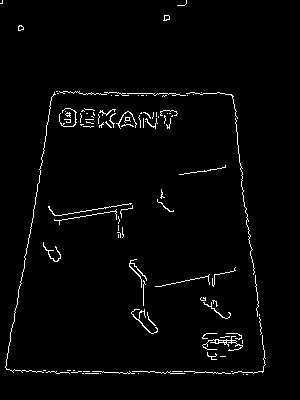

# How to Use OpenCV.js in Web Apps
This is a simple web document management app. You can have fun with the HTML5 app in desktop or mobile **Chrome**.

## Features
* Write, read and remove images with **FileSystem** APIs in Chrome.
* Use **OpenCV.js** to detect edges.

## Getting Started
1. Deploy the project to your web server.
2. Open **http://localhost:1818** in Chrome.

    

## Reference
* https://github.com/ucisysarch/opencvjs
* https://www.html5rocks.com/en/tutorials/file/filesystem/

